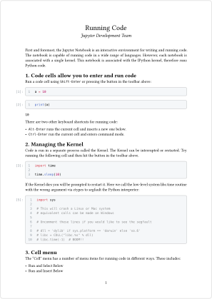

# jutyper

A package for rendering Jupyter notebooks.

## Usage

The package provides the `notebook` function, which parses a `.ipynb` file and renders the Jupyter notebook. The function takes a single positional argument for the JSON-decoded notebook data, and some optional named arguments for customizing the rendering:

| Parameter      | Type                      | Description                                                        | Default |
| -------------- | ------------------------- | ------------------------------------------------------------------ | ------- |
| `title`        | `content`, `auto`, `none` | The title of the notebook.                                         | `auto`  |
| `line-numbers` | `boolean`                 | Whether to display line numbers in code cells.                     | `false` |
| `line-wrap`    | `boolean`                 | Whether to wrap long lines in code cells instead of clipping them. | `false` |
| `output-limit` | `integer`                 | The maximum number of lines to show in each text output cell.      | `50`    |

If `title` is set to `content`, the title of will be extracted automatically from the first level-1 heading found in the notebook. Any subsequent higher-level headings will then be promoted by one level. When a title is available (either extracted or given explicitly), it will be displayed before the notebook content, together with the any authors specified in the document context. The full title including authors is labeled with `<jutyper:title>`, which can be used to prevent the automatic title from being displayed, in case you want to handle the title yourself.

To allow excluding specific cells from the rendering, this package labels each cell with `<jutyper:cell:{num}>`, where `{num}` is the cell's execution number. Similarly, each code input and output is labeled with `<jutyper:input:{num}>` and `<jutyper:output:{num}>`, respectively. You can use these labels in show rules to prevent them from being displayed.

### Supported Cell Types

The following cell types are supported by the renderer:

- `code` cells are rendered as code blocks with their respective execution number.
- `markdown` cells are rendered via the [`cmarker`](https://typst.app/universe/package/cmarker/) and [`mitex`](https://typst.app/universe/package/mitex/) packages.

The outputs of each code cell are displayed in the order they appear in the notebook. The renderer supports the following output types:

- `stream` outputs are rendered as text blocks. If the stream is `stderr`, the text blocks will have a red background.

- `display_data` and `execute_result` outputs are rendered as images (SVG, PNG, JPEG, or GIF), LaTeX, markdown, plain text, or JSON (in this order of precedence). Raster images are expected to be encoded in base64, and are decoded with [`based`](https://typst.app/universe/package/based/).

- `error` outputs are rendered as text blocks with ANSI highlighting by [`ansi-render`](https://typst.app/universe/package/ansi-render/). Cells that produce errors are marked with a red background.

Text outputs are limited to a maximum number of lines, which can be customized using the `output-limit` parameter. If the output exceeds the limit, a message will be displayed indicating that some lines have been omitted.

Any unsupported cell and output types will be silently ignored and not displayed in the rendered output.

## Example

_(Source of the example: [Jupyter Documentation](https://jupyter-notebook.readthedocs.io/en/stable/examples/Notebook/Running%20Code.html))_

```typ
#import "@preview/jutyper:0.1.0": notebook

#set document(authors: "Jupyter Development Team")
#set page(numbering: "1")
#set par(justify: true)
#set heading(numbering: "1.")

#notebook(
  line-numbers: true,
  json("example.ipynb")
)
```


